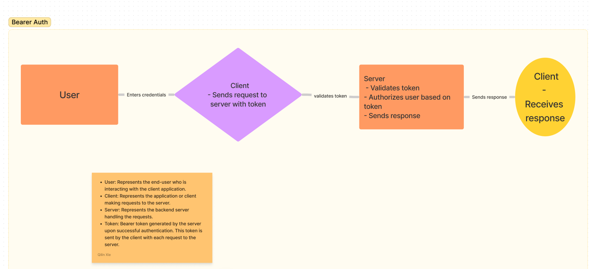

# bearer-auth

-[class 7 instructor README](https://github.com/codefellows/seattle-javascript-401d58/tree/main/class-07)

-[Github action link](https://github.com/QILINXIE02/bearer-auth/actions)

-[PR to main](https://github.com/QILINXIE02/bearer-auth/pull/1)

#### Description
In this phase of the Authentication Server development, we implement Token (Bearer) Authentication.

Our authentication server is now capable of enabling users to create accounts and handling Basic Authentication (where users provide a username and password). Upon successful login, the user is considered authenticated, and our authentication server generates a JWT (JSON Web Token) signed "Token" which is then returned to the application.

We will utilize this Token to re-authenticate users and to protect access to routes that require a valid login.

#### Phase 2 Requirements
1. Obtain a token after user signin, allowing users to re-authenticate.
2. Users will use their token to access routes that demand a valid user.
3. Provide secure logging for users.
4. Secure the JWT Tokens:
   - Implement time-sensitive JWTs, valid for 15 minutes.

#### Dependencies
- Express
- Dotenv
- Jest
- Morgan
- Bcrypt
- Cors
- jsonwebtoken

UML diagram: 
